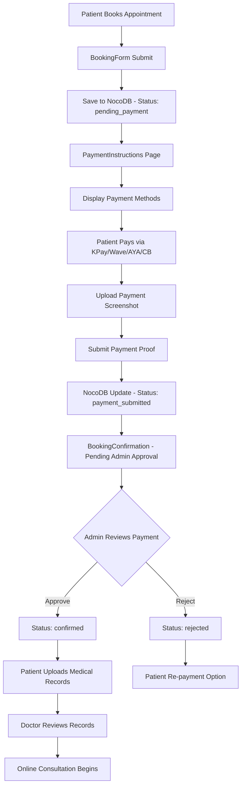

# Payment System Integration Plan
## Dr. Tun Myat Win - Online Consultation Payment System

---

## 📋 Current System Analysis

### Existing Flow:
```
BookingForm → PaymentInstructions → BookingConfirmation (static status)
```

### Current Issues:
1. Payment status not tracked in database
2. No payment screenshot upload
3. No medical records upload system
4. BookingConfirmation status is hardcoded (not dynamic)
5. No "My Appointments" page for patients
6. No admin approval workflow
7. No section/time slot categorization (morning/evening)

---

## 🎯 New Payment System Flow



---

## 📊 Updated Database Schema (NocoDB)

### New Fields to Add:

| Field Name | Type | Description |
|------------|------|-------------|
| `BookingID` | AutoNumber | Unique booking identifier |
| `PaymentStatus` | Single Select | pending → payment_submitted → confirmed → rejected |
| `PaymentMethod` | Single Select | KPay, Wave Pay, AYA Pay, CB Pay |
| `PaymentPhone` | Text | 09421068582 (fixed) |
| `PaymentScreenshot` | Attachment | Payment proof image |
| `PaymentDate` | DateTime | When payment was made |
| `BookingSection` | Single Select | morning (9AM-12PM), evening (2PM-8PM) |
| `DoctorName` | Text | ဒေါက်တာထွန်းမြတ်ဝင်း |
| `ConsultationType` | Text | online |
| `MedicalRecords` | Attachment | Multiple files for patient records |
| `MedicalRecordsStatus` | Single Select | pending → submitted → reviewed |
| `AdminNotes` | Long Text | Admin comments |
| `BookingStatus` | Single Select | pending → confirmed → completed → cancelled |

---

## 🆕 New Features to Implement

### 1. Enhanced BookingForm (`src/components/BookingForm.jsx`)
**Changes:**
- Add `booking_section` field (Morning/Evening)
- Auto-calculate section based on selected time
- Add section display in form

```javascript
// Add to formData
const [formData, setFormData] = useState({
    // ... existing fields
    booking_section: 'morning', // morning or evening
});

// Auto-set section based on time
const getSectionFromTime = (time) => {
    const hour = parseInt(time.split(':')[0]);
    return hour < 12 ? 'morning' : 'evening';
};
```

---

### 2. Payment Screenshot Upload (`src/pages/PaymentInstructions.jsx`)
**New Feature:**
- File upload input for payment screenshot
- Image preview before upload
- Upload to NocoDB attachment field
- Show upload progress

**Payment Methods (Already configured):**
- ✅ KPay
- ✅ Wave Pay  
- ✅ AYA Pay
- ✅ CB Pay
- ✅ Phone: 09421068582

**New UI Elements:**
```jsx
<div className="payment-upload">
    <h3>ငွေပေးချေမှုပုံရိပ် တင်ပို့ရန်</h3>
    <input type="file" accept="image/*" onChange={handleScreenshotUpload} />
    {screenshotPreview && }
    <button onClick={submitPaymentProof}>ငွေပေးချေမှုအတည်ပြုချက် တင်ပို့ရန်</button>
</div>
```

---

### 3. Medical Records Upload Page (`src/pages/MedicalRecordsUpload.jsx`)
**New Page:**
- File upload for multiple medical records
- Support: PDF, JPG, PNG
- Show uploaded files list
- Submit to NocoDB

**Route:** `/medical-records-upload`

**Features:**
- Drag & drop upload area
- Multiple file support
- File size validation (max 10MB per file)
- Preview uploaded files
- Delete option before final submit

---

### 4. My Appointments Page (`src/pages/MyAppointments.jsx`)
**New Page:**
- Show all patient bookings (filter by phone/email)
- Display booking status with color coding
- Show payment status
- Link to upload medical records
- Link to booking confirmation

**Route:** `/my-appointments`

**Features:**
```jsx
// Search form to find appointments
<SearchForm onSearch={(phone/email) => fetchBookings()} />

// Booking cards
<BookingCard>
    <StatusBadge status="confirmed" />
    <DoctorInfo>ဒေါက်တာထွန်းမြတ်ဝင်း</DoctorInfo>
    <DateTimeDisplay />
    <SectionBadge>morning/evening</SectionBadge>
    <PaymentStatusBadge />
    <Actions>
        <Link to="/medical-records-upload">မှတ်တမ်းတင်ရန်</Link>
        <Link to="/booking-confirmation">အသေးစိတ်ကြည့်ရန်</Link>
    </Actions>
</BookingCard>
```

---

### 5. Enhanced BookingConfirmation (`src/pages/BookingConfirmation.jsx`)
**Updates:**
- Fetch real-time status from NocoDB (not hardcoded)
- Show full details:
  - ✅ Doctor Name: ဒေါက်တာထွန်းမြတ်ဝင်း
  - ✅ Date & Time
  - ✅ Section (Morning/Evening)
  - ✅ Payment Status
  - ✅ Booking Status
- Add "Upload Medical Records" button when confirmed
- Show next steps based on status

**Status Flow Display:**
```jsx
{status === 'pending_payment' && (
    <div>ငွေပေးချေရန် ကျန်ရှိနေပါသည်</div>
)}
{status === 'payment_submitted' && (
    <div>ငွေပေးချေမှု အတည်ပြုချက်ကို စောင့်ဆိုင်းနေပါသည်...</div>
)}
{status === 'confirmed' && (
    <div>
        ✅ အတည်ပြုပြီးပါပြီ!
        <Link to="/medical-records-upload">ကျန်းမာရေးမှတ်တမ်း တင်ရန်</Link>
    </div>
)}
```

---

### 6. Admin Notification System
**Options:**

#### Option A: NocoDB Webhook + Telegram Bot (Recommended)
- NocoDB triggers webhook on record update
- Webhook sends to Telegram Bot API
- Admin receives notification in Telegram group
- Admin can approve/reject via bot commands

#### Option B: NocoDB Views + Manual Check
- Create "Pending Payments" view in NocoDB
- Admin manually checks and updates status
- Send Telegram notification using NocoDB automation

**Implementation (Option A):**
```javascript
// Webhook endpoint (need to create simple backend or use Zapier/Make)
// When payment_submitted status:
// 1. Send Telegram to admin: "New payment from {name}, {amount}, {bookingId}"
// 2. Admin replies: "/approve {bookingId}" or "/reject {bookingId}"
// 3. Update NocoDB status accordingly
```

---

## 🎨 UI/UX Improvements

### Color Coding for Status:
| Status | Color | Meaning |
|--------|-------|---------|
| pending_payment | 🟡 Yellow | Waiting for payment |
| payment_submitted | 🔵 Blue | Payment proof submitted |
| confirmed | 🟢 Green | Payment approved, booking confirmed |
| rejected | 🔴 Red | Payment rejected |
| completed | ⚪ Gray | Consultation completed |

---

## 📱 Additional Suggestions

### 1. SMS/Telegram Notifications
- ✅ Patient receives Telegram notification when payment approved
- ✅ Patient receives reminder 2 hours before consultation
- ✅ Doctor receives notification when medical records uploaded

### 2. Booking Reference Number
- Generate unique booking reference (e.g., DR-20240423-001)
- Display on confirmation page
- Use for patient to check status

### 3. Consultation Link
- Auto-generate Zoom/Google Meet link when confirmed
- Display on confirmation page
- Send via Telegram/Email

### 4. Payment Amount Display
- Show clearly: တိုင်ပင်ခ ၁၀,၀၀၀ ကျပ်
- Show consultation duration: ၃၀ မိနစ်
- Show section timing in description

### 5. Calendar Integration
- Add to patient's calendar (iCal/Google Calendar link)
- Send .ics file after confirmation

### 6. Multi-language Support
- Currently in Myanmar (my)
- Consider English toggle for international patients

---

## 🛠️ Implementation Steps (Priority Order)

### Phase 1: Core Payment Integration (Week 1)
1. [ ] Update NocoDB schema with new fields
2. [ ] Add payment screenshot upload to PaymentInstructions
3. [ ] Update BookingConfirmation to fetch real status from NocoDB
4. [ ] Add booking_section to BookingForm

### Phase 2: Medical Records (Week 2)
5. [ ] Create MedicalRecordsUpload page
6. [ ] Add file upload functionality
7. [ ] Link from BookingConfirmation when status is confirmed

### Phase 3: Patient Portal (Week 3)
8. [ ] Create MyAppointments page
9. [ ] Add search functionality (by phone/email)
10. [ ] Add to Navbar navigation

### Phase 4: Admin & Notifications (Week 4)
11. [ ] Setup Telegram bot for admin notifications
12. [ ] Create webhook/automation for status updates
13. [ ] Add admin approval workflow

### Phase 5: Polish & Testing (Week 5)
14. [ ] End-to-end testing
15. [ ] Add notifications (Telegram/SMS)
16. [ ] Performance optimization
17. [ ] Mobile responsiveness check

---

## 🔗 Route Structure (Updated)

```
/                           → LandingPage
/thank-you                  → ThankYouPage (ebook download)
/payment-instructions       → PaymentInstructions (payment + screenshot upload)
/booking-confirmation       → BookingConfirmation (status display)
/medical-records-upload     → NEW: MedicalRecordsUpload
/my-appointments            → NEW: MyAppointments
```

---

## 📝 NocoDB API Integration Examples

### Update Payment Status:
```javascript
const updatePaymentStatus = async (bookingId, status, screenshotUrl) => {
    const response = await fetch(
        `${NOCODB_API_URL}/api/v2/tables/${NOCODB_TABLE_ID}/records`,
        {
            method: 'PATCH',
            headers: {
                'Content-Type': 'application/json',
                'xc-token': NOCODB_API_TOKEN
            },
            body: JSON.stringify({
                Id: bookingId,
                PaymentStatus: status,
                PaymentScreenshot: screenshotUrl,
                PaymentDate: new Date().toISOString()
            })
        }
    );
    return response.json();
};
```

### Fetch Booking by Phone:
```javascript
const fetchBookingsByPhone = async (phone) => {
    const response = await fetch(
        `${NOCODB_API_URL}/api/v2/tables/${NOCODB_TABLE_ID}/records?where=(Phone,eq,${phone})`,
        {
            headers: { 'xc-token': NOCODB_API_TOKEN }
        }
    );
    return response.json();
};
```

---

## ✅ Success Criteria

1. ✅ Patient can book appointment
2. ✅ Patient can pay via KPay/Wave/AYA/CB to 09421068582
3. ✅ Patient can upload payment screenshot
4. ✅ Admin gets notified of new payment
5. ✅ Admin can approve/reject payment
6. ✅ Patient sees real-time status update
7. ✅ Patient can upload medical records after confirmation
8. ✅ Patient can view all appointments in "My Appointments"
9. ✅ Booking shows doctor, date, time, and section
10. ✅ Telegram notifications sent at each stage

---

## 🚨 Important Notes

1. **Security**: Payment screenshots may contain sensitive info - ensure proper access control in NocoDB
2. **Phone Number**: Fixed at 09421068582 for all payment methods
3. **Consultation Fee**: Fixed at ၁၀,၀၀၀ MMK for ၃၀ minutes
4. **Doctor**: Currently single doctor (ဒေါက်တာထွန်းမြတ်ဝင်း) - system can be extended for multiple doctors
5. **NocoDB**: Consider creating separate tables for Bookings and Payments for better organization

---

## 📞 Contact for Admin

**Payment Notifications Send To:**
- Telegram: @drtunhealthconsultant
- Phone: 09421068582
- Viber: Available

---

*This plan is ready for implementation. Please review and approve to proceed with development.*
